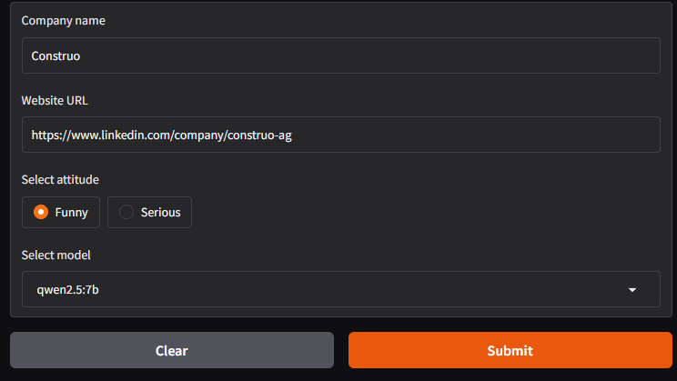

# ollama-sandbox

A collection of standalone scripts, Jupyter notebooks, and other small tools that use [Ollama](https://ollama.com) and
open-source LLMs.

## Prerequisites

All tools assume that Ollama is installed and that you have at least one model available.

1. [Download and install Ollama](https://ollama.com/download).
2. Open **PowerShell** or **Command Prompt**.
3. Pick a model from [Ollama Models](https://ollama.com/search).
    - Models come in different parameter sizes (e.g. `3b`, `7b` for 3 billion / 7 billion parameters).
    - Clicking on a model shows a table with the disk space required for each size.
4. Run:
   ```powershell
   ollama run MODEL_NAME

- The first run downloads the model.
- Type `/bye` to exit.

5. List installed models:
   ```powershell
   ollama list
6. Remove a model:
   ```powershell
   ollama rm MODEL_NAME

---

## ai-commit

A Windows script that generates a Git commit message from your staged changes

**Usage**

1. In the script (line 28), set the model name to one you’ve already downloaded in Ollama
2. Copy the script into a folder listed in your system PATH (or add its folder to PATH)
3. By default, PowerShell blocks scripts. To allow it for the current session, run:
   ```powershell
   Set-ExecutionPolicy -Scope Process -ExecutionPolicy Bypass
4. From your Git project folder, run:
   ```powershell
   ai-commit

This will generate and print a commit command like:

   ```powershell
   git commit -m "Implement graceful shutdown for worker threads"
```

5. For you the up arrow key might work to recall the last command. For me it doesn't, so I just copy-past the generated
   command, edit the message if needed, and hit Enter
6. Run ai-commit again to regenerate (subsequent runs are faster because the model stays warm)

---

## events-post-creator

A Jupyter notebook that generates posts for Twitter, Instagram and Facebook (all in Markdown) from content of a given
URL. Accounts for a language

**Usage**

1. Install ollama python package (either with pip or with PyCharm packages window or directly from the notebook)
2. Run all the cells, the output will appear at the bottom. Depending on your machine and the website might take from
   1 to 4 minutes to execute the code

---

## leader-election

A Jupyter notebook that simulates a leadership election among three AI chatbots (Alex, Blake, Charlie) using open-source
LLMs via Ollama. Each AI generates a pitch for leadership and votes on others' pitches, with a winner determined by
majority vote.

**Prerequisites**

1. Install the `ollama` Python package (e.g., `pip install ollama` or via PyCharm).
2. Ensure Ollama server is running at `http://localhost:11434` with models:
    - `llama3.2:3b`
    - `qwen2.5:7b`
    - `mistral:7b`
      Run `ollama pull <model_name>` for each.
3. Install `IPython` for Markdown rendering (e.g., `pip install ipython`).

**Usage**

1. Open the notebook in PyCharm's Jupyter mode
2. Run all cells with `Ctrl+Enter` (per cell) or "Run All"
3. Outputs (in Markdown):
    - Model name as header, system prompt in italic, user prompt, pih.
    - Voting results: model (name), "voted for", voted name
    - Winner/tie

For voting temperature is adjusted, otherwise models don't stick to 1-token reply, and keep giving a long speech on whom
do they vote and why

4. Execution time depends on CPU and models (typically 1-5 minutes for all pitches and votes)

---

## company-brochure-generator

A Jupyter notebook that streams a short, humorous, emoji-rich company brochure in Markdown by scraping a website (or
LinkedIn page).

Scrapes a company site, classifies links (e.g., About, Careers) outputs them ***in json format***, scaps the content of
collected links, concatenates its content into a second prompt to ollama, anf rom that generates a fun brochure
***in streaming mode*** with witty, engaging text for customers, investors, and recruits.

**Input**: GUI in browser on localhost http://127.0.0.1:[random_port], forced dark theme:



**Output**: Live-streamed Markdown brochure with humorous wording, e.g.:
   ```markdown
   # Construo: Building with a Wink! 😎
   Swiss tech wizards making construction fun...
   ```

---

## windows-linux-hollywar

A Jupyter notebook that simulates 2 argumentative bots debating Linux vs Windows, with a polite Judge finding common ground.
Uses Gemini free tier to generate witty, personality-driven responses in a live conversation stream.

**Bots:**
- 🐧 Linux Fan: Snarky, disagrees with everything, loves Linux
- 🪟 Windows Fan: Sarcastic, challenges everything, loves Windows  
- ⚖️ Judge: Polite, calms them down, finds common ground

### **Usage**
1. Install: `pip install google-generativeai python-dotenv`
2. Add `GOOGLE_API_KEY` to `.env` file
3. Run all the cells
4. Output: Live-streamed debate with 5 rounds!

## sponge-bob-chat
Chat with Sponge Bob Square Pants. Uses chat interface from Gradio, custom CSS for the theme, a local ollama model to generate responses

## tools
Example of using tools (python functions) for LLM - price flights assistant chatbot with 2 defined tools: get_airport function 
and get_base_price function. Uses chat interface from Gradio and local ollama model to generate responses
